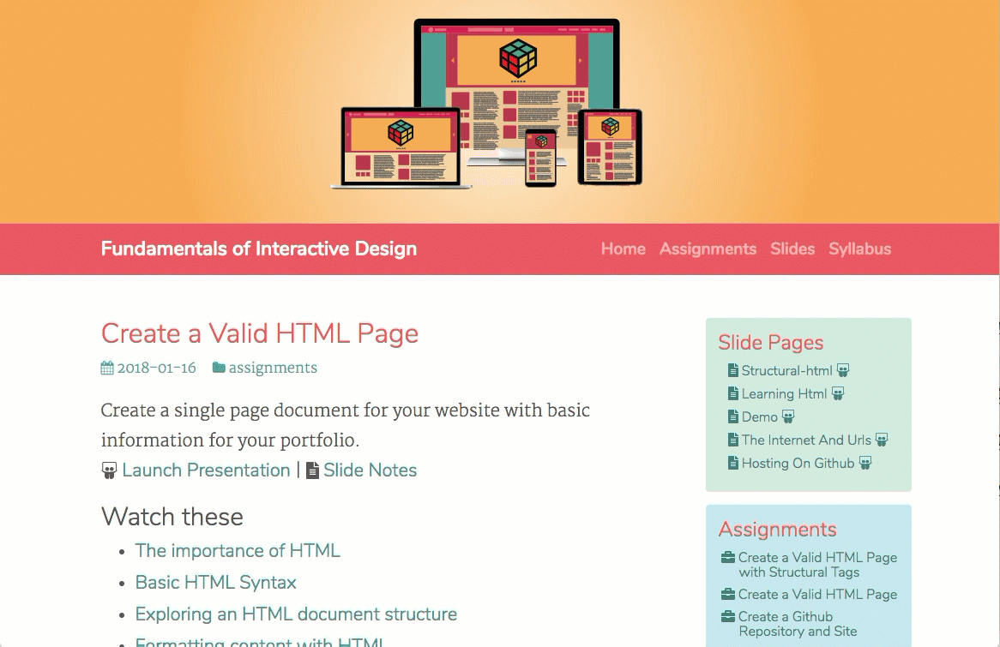

<!-- .slide: data-state="title" -->

# Structural Elements

---

## The HTML Outline [<i class="icon icon-lynda"></i>](https://www.lynda.com/Web-Development-tutorials/Controlling-document-outlines/170427/196153-4.html) 

<!-- .element: style="width:60%" -->

<small>Right click -> Inspect</small>

### Author Notes

When you create a page, you start with some text and what you're doing as a developer is adding markup to that content that helps define the structure of the page. You can think of it as creating an outline of a book. The book might have a title and some headlines or other content.

You can take a peek at this outline using different browsers. In Google Chrome, you can right click on a page and then choose `inspect`. You'll be taken to a special developer view where you can see the outline that HTML is describing.

On the left side of the `elements` tab, you'll see a series of triangles that you can use to expand and collapse the outline. There's also an outline navigation bar at the very bottom of the page.

Notice that when you hover over the content on the page or you make selections on the elements tab, the browsers will highlight that area of the page.

Your editor can also do that, but only if you're using whitespace to intent code properly.

---

## Structural Elements

https://www.lynda.com/Web-Development-tutorials/value-structure/170427/196152-4.html

- Block level
- Define Areas
- Common and Generic

### Author Notes

Structural elements in HTMl are a set of block level elements that help you futher enhance the structure of your sites. By block level, we mean that these are major sections of your site which are usually displayed as having space before and after the section.

They are useful because them make it easy to define areas of content and separate the regular content from utility areas on your HTML. So for example, you can identify a section of code to represent a footer. That usually means the bottom of a page or even another section with some supporting content.

They are usually fairly common areas that people have on websites like headers, footers, navigation, sidebars, etc. Although these names have specific conotations in terms of usage, they are flexible enough so that they can take on a few different contexts. For example, you can have the footer tag come to define the bottom footer of the whole page, but it could also mean a footer at the bottom of some html displaying a product.

---

## Header [<i class="icon icon-lynda"></i>](https://www.lynda.com/Web-Development-tutorials/Other-semantic-elements/170427/196159-4.html) [<i class="icon icon-mdn"></i>](https://developer.mozilla.org/en-US/docs/Web/HTML/Element/header)

- Introductory content
- Inside other elements

<iframe height='400' scrolling='no' title='Header Sample' src='//codepen.io/planetoftheweb/embed/GyegZO/?height=300&theme-id=27192&default-tab=html&embed-version=2' frameborder='no' allowtransparency='true' allowfullscreen='true' style='height: 40vh; width: 100%;'>See the Pen <a href='https://codepen.io/planetoftheweb/pen/GyegZO/'>Header Sample</a> by Ray Villalobos (<a href='https://codepen.io/planetoftheweb'>@planetoftheweb</a>) on <a href='https://codepen.io'>CodePen</a>.
</iframe>

### Author Notes

The `header` element represents introductory content and it's often used at the top of a page. At the top of the page it often contains the navigation for the site or some introductory content. 

It can sometimes be confused with the `head` element which is used for items you don't want the browser to display.

However, a header can also be used inside other elements, so for example you can have a `sidebar` header or an `article` header.

---

## Footer [<i class="icon icon-lynda"></i>](https://www.lynda.com/Web-Development-tutorials/Other-semantic-elements/170427/196159-4.html) [<i class="icon icon-mdn"></i>](https://developer.mozilla.org/en-US/docs/Web/HTML/Element/footer)

- Introductory content
- Inside other elements

<iframe height='400' scrolling='no' title='Header Sample' src='//codepen.io/planetoftheweb/embed/GyegZO/?height=300&theme-id=27192&default-tab=html&embed-version=2' frameborder='no' allowtransparency='true' allowfullscreen='true' style='height: 40vh; width: 100%;'>See the Pen <a href='https://codepen.io/planetoftheweb/pen/GyegZO/'>Header Sample</a> by Ray Villalobos (<a href='https://codepen.io/planetoftheweb'>@planetoftheweb</a>) on <a href='https://codepen.io'>CodePen</a>.
</iframe>

### Author Notes

---

## Nav Element

- [nav](http://mdn.beonex.com/en/HTML/Element/nav.html)
- Major Navigation Blocks

<iframe class="fragment" height='500' scrolling='no' title='ZXoMmO' src='//codepen.io/planetoftheweb/embed/ZXoMmO/?height=300&theme-id=27192&default-tab=html&embed-version=2' frameborder='no' allowtransparency='true' allowfullscreen='true' style='height: 50vh; width: 100%;'>See the Pen <a href='https://codepen.io/planetoftheweb/pen/ZXoMmO/'>ZXoMmO</a> by Ray Villalobos (<a href='https://codepen.io/planetoftheweb'>@planetoftheweb</a>) on <a href='https://codepen.io'>CodePen</a>.
</iframe>

### Author Notes

The role of the nav element is to identify major blocks of navigation.

Not everything that is a list of links should be a nav on the page but most pages have at least some navigation at the top of the page as well as some secondary bottom navigation or maybe some sidebar navigation.

Identifying navs in your document can help screen readers as well as search engines understand the role of these set of links better. So, for example screen readers might omit the rendering of this section.

This is a compound tag and inside these people usually have either a list element `UL` or just a set of links `A`.

---

## Article

- [article](https://developer.mozilla.org/en-US/docs/Web/HTML/Element/article)
- Self contained composition

<iframe height='500' scrolling='no' title='Simple Navs' src='//codepen.io/planetoftheweb/embed/BJMXdO/?height=300&theme-id=27192&default-tab=html,result&embed-version=2' frameborder='no' allowtransparency='true' allowfullscreen='true' style='width: 100%; height: 50vh;'>See the Pen <a href='https://codepen.io/planetoftheweb/pen/BJMXdO/'>Simple Navs</a> by Ray Villalobos (<a href='https://codepen.io/planetoftheweb'>@planetoftheweb</a>) on <a href='https://codepen.io'>CodePen</a>.
</iframe>

### Author Notes

The `article` element is one of those weird and hard to explain elements. The description in the documentation is quite scary, but I tend to think of the article element as one of two things, like a literal article that someone writes or as an article of clothing. So if you're looking at a list of shoes on nike.com, each of the pieces of code describing the shoes could be thought of as an article.

The rules are pretty simple. Articles should include a heading `h1-h6` inside the article tag. You can also nest articles inside other articles (say a list of the types of shoelaces options you can get for the shoes). 

---

## Main

### Author Notes

---

## Aside

### Author Notes

---

## Div & Span

### Author Notes

---

## Files &amp; Folders

### Author Notes

### Author Notes

[<i class="icon icon-mdn"></i>](https://www.lynda.com/Web-Development-tutorials/Controlling-document-outlines/170427/196153-4.html)

https://www.lynda.com/Web-Development-tutorials/nav-element/170427/196154-4.html

https://www.lynda.com/Web-Development-tutorials/article-element/170427/196155-4.html

https://developer.mozilla.org/en-US/docs/Web/HTML/Element/nav

https://developer.mozilla.org/en-US/docs/Web/HTML/Element/article

https://developer.mozilla.org/en-US/docs/Web/HTML/Element/section

https://www.lynda.com/Web-Development-tutorials/section-element/170427/196156-4.html

https://developer.mozilla.org/en-US/docs/Web/HTML/Element/div

https://www.lynda.com/Web-Development-tutorials/div-element/170427/196158-4.html

https://www.lynda.com/Web-Development-tutorials/Other-semantic-elements/170427/196159-4.html

https://developer.mozilla.org/en-US/docs/Web/HTML/Element/main

https://www.lynda.com/Web-Development-tutorials/Linking-page-regions/170427/196168-4.html